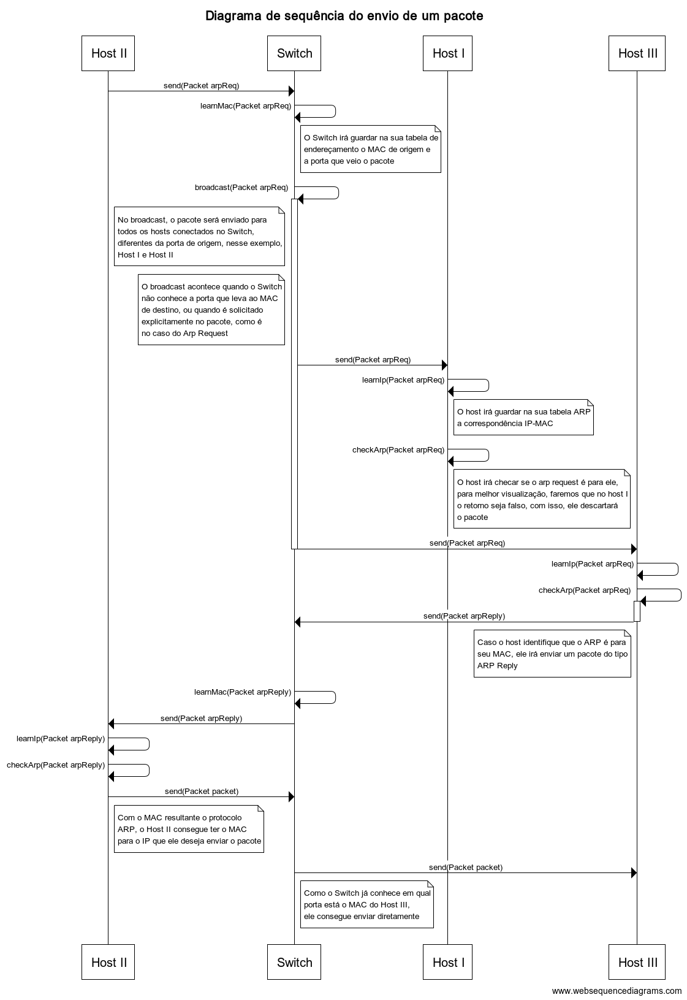

# redes-ii-arp-implementation
O objetivo dessa aplicação é implementar em algo nível o protocolo ARP, utilizado pelos dispositivos de rede para encontrar um MAC a partir de um IP. O funcionamento desse protocolo é descrito no diagrama abaixo:

## Montando a infraestrutura
Na classe principal, app.Application, existe um exemplo mostrando as funções necessárias para criar uma infraestrutura e enviar pacotes por ela.

## Verificando se os pacotes estão chegando ao seu destino
Para saber se o pacote chegou ao destino correto, sempre que um host recebe uma mensagem, por padrão, ele irá disparar um log contendo a mensagem recebida e o seu MAC.

## Como executar a aplicação
Algumas formas de executar essa aplicação são:

1. Na IDE de preferência, execute a classe principal (app.Application);
2. Com o Maven instalado, execute na raiz do projeto o comando **mvn exec:java**.